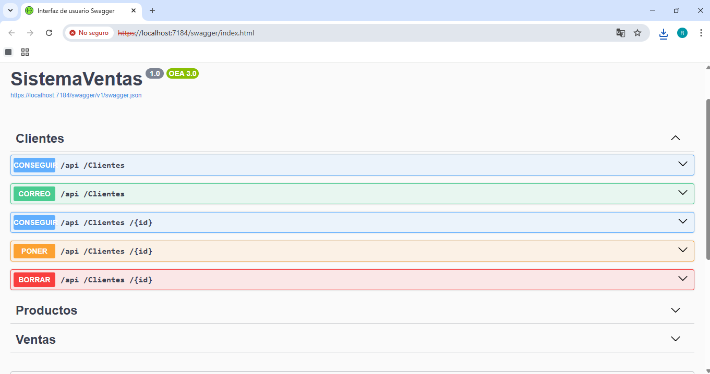

# 🛒 Sistema de Ventas API

Este proyecto es una **Web API profesional** desarrollada con .NET para la gestión integral de inventarios, clientes y transacciones comerciales. La solución aplica una arquitectura limpia y el patrón de servicios para garantizar un código mantenible y escalable.

## 🛠️ Stack Tecnológico
* **Framework:** ASP.NET Core Web API (.NET 8/9)
* **Lenguaje:** C#
* **ORM:** Entity Framework Core (Code First)
* **Base de Datos:** SQL Server
* **Patrones de Diseño:** Repository/Service Pattern, DTOs (Data Transfer Objects)
* **Documentación:** Swagger / OpenAPI

 ## 🗄️ Configuración de Base de Datos
Para que el proyecto funcione en tu equipo local, sigue estos pasos:

1. **Abre el archivo `appsettings.json`** y ajusta el `Server` en la cadena de conexión para que apunte a tu instancia local de SQL Server.
2. **Abre la Consola del Administrador de Paquetes** en Visual Studio (*Herramientas > Administrador de Paquetes NuGet*).
3. **Ejecuta el comando:**
   ```powershell
   Update-Database 

## 📂 Estructura de la Solución
El proyecto está organizado para separar la lógica de negocio de la exposición de datos:
* **Controllers:** Endpoints RESTful para Clientes, Productos y Ventas.
* **Services:** Contiene la lógica de negocio (Interfaces e Implementaciones).
* **Models & DTOs:** Definición de entidades de base de datos y objetos de transferencia seguros.
* **Migrations:** Gestión de versiones del esquema de la base de datos.

## ✨ Funcionalidades Principales
- [x] **Gestión de Productos:** CRUD completo con validación de stock.
- [x] **Administración de Clientes:** Registro y seguimiento de clientes.
- [x] **Procesamiento de Ventas:** Lógica para registrar transacciones y actualizar inventario automáticamente.
- [x] **Documentación Interactiva:** Interfaz de Swagger para pruebas rápidas de los endpoints.

## 🚀 Guía de Instalación
1. **Clonar el repositorio:**
   ```bash
   git clone [https://github.com/RaulDR1309/SistemaVentas_Api.git](https://github.com/RaulDR1309/SistemaVentas_Api.git)

## Vista Previa
* 
